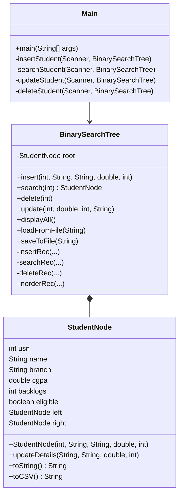

# Student Gradebook Manager for Placements using Binary Search Trees

## 📌 Problem Statement
The **Student Gradebook Manager** helps the placement cell store, manage, and retrieve student academic data efficiently using **Binary Search Trees (BST)**. It allows for fast searching, insertion, updating, and deletion of student records based on their Unique Student Number (USN).

## ⚙️ Technical Requirements
- **Language**: Java 8+
- **Data Structure**: Binary Search Tree (BST)
- **Storage**: CSV File (`students.csv`)
- **Interface**: Console-based Menu
- **Web Frontend**: Responsive HTML/CSS/JS (Prototype)

> The frontend is implemented as a responsive web application using HTML, CSS, and JavaScript. It provides interactive pages for inserting, searching, updating, and deleting student records. JavaScript handles user interactions and dynamic content updates. The backend logic using Binary Search Tree is implemented in Java and operates independently. Backend integration can be done using Java Servlets as a future enhancement.

## 🚀 How to Run
1. **Compile the code**:
   ```sh
   javac *.java
   ```
2. **Run the application**:
   ```sh
   java Main
   ```
3. Follow the on-screen menu instructions.

## 📂 Project Structure
- `Main.java`: The entry point containing the menu loop.
- `BinarySearchTree.java`: Contains logic for BST operations (Insert, Search, Delete, Update, IO).
- `StudentNode.java`: Represents a single student record.
- `students.csv`: Stores the persistent data.

## 🧠 Class Diagram


## 📝 Features
1. **Insert**: Add detailed student records. Checks for duplicate USNs.
2. **Search**: Find students by USN quickly (O(log n) average).
3. **Update**: Modify academic details and auto-recalculate placement eligibility.
4. **Delete**: Remove records using full BST deletion logic (handle leaf, single child, two children).
5. **Display**: View all students sorted by USN (Inorder Traversal).
6. **Persistence**: Data is saved to `students.csv` on exit and loaded on startup.

## ✅ Eligibility Criteria
- **Eligible**: CGPA >= 7.0 AND Backlogs = 0.

## 🔮 Future Enhancements
- GUI Interface using JavaFX or Swing.
- More complex search filters (by Branch, Name).
- Balancing the BST (AVL or Red-Black Tree) for worst-case O(log n).
